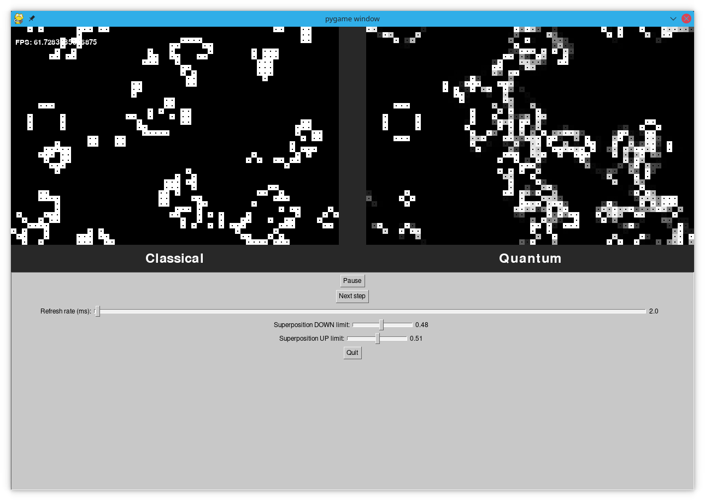
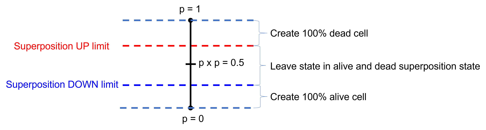

# Quantum Games 2022 by Aalto University - Quantum Game of Life

## What is it?

This game is a quantum version of [Conway's Game of Life](https://en.wikipedia.org/wiki/Conway%27s_Game_of_Life).

Instead of just being alive or dead, cells can be in a superposition of being alive and dead at the same time.

For more details, please have a look at these presentations:

* [Qiskit Hackathon Madrid 2019 presentation](presentation/n_dimensional_quantum_game_of_life.pdf).
* [Quantum Games 2022 presentation](presentation/QG_Quantum_GOL_v2.pdf)

The game can also be played online at: https://replit.com/@AayushKucheria/qonwaygameoflife-1

A gameplay video is available here: https://www.youtube.com/watch?v=3d10NwTH8bc

## What did we do?

This game was originally forked from https://github.com/qonwaygameoflife/qonwaygameoflife, which was made for the [Qiskit Hackathon Madrid 2019](https://madrid.qiskit.camp/).

The game was updated here for the [Quantum Games Course 2022 by Aalto University](https://quantumgames.aalto.fi/), with a graphical user interface, as well as the ability to pause the game, advance it step by step, change the refresh rate and tweak the superposition limits used to place new quantum cells.

## Show me the code

### Environment

In order to run this code, you have to clone this repo & prepare a python virtual environment:

```
> git clone https://github.com/qonwaygameoflife/qonwaygameoflife.git
> cd qonwaygameoflife/
> python3 -m virtualenv QiskitEnv
> source QiskitEnv/bin/activate
(QiskitEnv) > pip install -r requirements.txt
```

### Qonway's Game of Life



These are three renditions of the quantum game of life - top left is the classical game of life, top right is the semi quantum version
and the bottom is a fully quantum kernel rendition. The fully quantum kernel uses a quantum cloning machine to bring cells to life as an average of the neighbouring cells.

Continous boundary conditions! And you can draw live cells! (draw on the top left classical game and the new cells will be replicated to the other 2).

#### Usage

```
(QiskitEnv) > python gol_2d/life.py -h
pygame 2.1.2 (SDL 2.0.16, Python 3.9.7)
Hello from the pygame community. https://www.pygame.org/contribute.html
usage: life.py [-h] [--no-gui] [--sp_up SP_UP] [--sp_down SP_DOWN] [--json JSON] [--refresh-rate REFRESH_RATE]

Quantum Game of Life

optional arguments:
  -h, --help            show this help message and exit
  --no-gui              Start simulation directly without loading GUI.
  --sp_up SP_UP         Superposition UP limit (default: 0.51)
  --sp_down SP_DOWN     Superposition DOWN limit (default: 0.48)
  --json JSON           Path to JSON file with pre-configured seed
  --refresh-rate REFRESH_RATE
                        Refresh rate in ms (default: 2)
```

All parameters are optional, if none is informed the entire board is randomly initialized.

Notice that `--sp_up` and `--sp_down` are float values between 0 and 1. Also, they are ignored if `--json` is informed.

We also provide a few JSON seeds you can try in [gol_2d/seeds](gol_2d/seeds):

```
(QiskitEnv) > python gol_2d/life.py --no-gui --json gol_2d/seeds/waitforit.json
(QiskitEnv) > python ./gol_2d/life.py --no-gui --json ./gol_2d/seeds/glider.json
(QiskitEnv) > python ./gol_2d/life.py --no-gui --sp_down 0.6 --sp_up 0.9 --json ./gol_2d/seeds/glider_quantum_chaos.json --refresh-rate=100
(QiskitEnv) > python ./gol_2d/life.py --no-gui --sp_down 0.6 --sp_up 0.9 --json ./gol_2d/seeds/glider_quantum_chaos.json --refresh-rate=1000
```

### What happens when I add new cells? What are the superposition limits?

When you click on any cell in the classical space, its state will be toggled, i.e. if there is no cell (dead cell), a cell is created and if there is a cell (alive cell), it gets killed.

At the same time, you create a new cell in the quantum space. But its alive or dead state will depend on the superposition limits.
The process is as follows:

When a new quantum cell is created:
1. Pick a random value **p** between 0 and 1.
1. If **p x p** > (UP limit), create a dead cell.
1. If **p x p** < (DOWN limit), create a live cell.
1. Else, create a cell that has a probability **p x p** of being dead and that is otherwise alive.



### Source

Cloned and updated from [Qiskit Hackathon Madrid 2019](https://madrid.qiskit.camp/) - Quantum Game of Life

### Attribution

* Instead of implementing the game from scratch, we re-purposed the code in: https://github.com/adrianchifor/conway-game-of-life.
* Semi quantum simulation is based on: https://arxiv.org/pdf/1902.07835.pdf. The quantum kernel is original.

